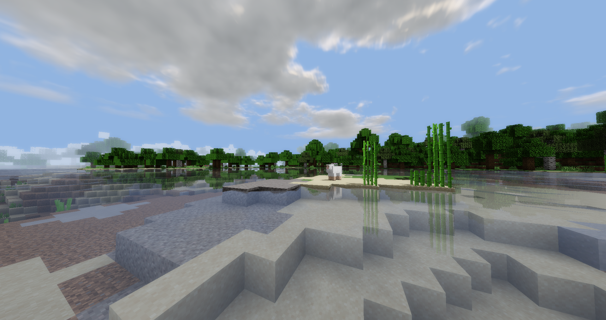

# Sasaki-Shaders

* A fundamental Minecraft shaderspack.

* This shader is made for fun.

### Features

* Waving Grass and Leaves
* Bloom
* Shadow
  * Using Shadow Mapping and Percentage Closer Filter
* Clouds
  * Based on [iq's Clouds](https://www.shadertoy.com/view/XslGRr) and using Ray Marching
* Water Surface Reflection 
  * Using 3D Screen Space Reflection (Ray Tracing)
* Dynamic and Transparent Water
* Water's Reflection of Sunshine

### TODO

* Cloud optimization
* Shadow algorithm optimization
  * Change algorithm to VSSM or MSM
* Adaptation to rainy days
  * Cloud
  * Raindrop
  * Fog
* Adaptation to hell

### Preview

### Minecraft versions

* Suggestion version: 1.18.2
* In the lower version, the "Optifine旧版模式" option needs to be enabled

### Reference

- I made this shader according to [szszss's article](http://blog.hakugyokurou.net/?page_id=1655) and it is really well written.
  - This article is using minecraft 1.7.10, so I adjust shader's code and let it run in 1.18.2.

### Sasaki！

* This shader's name comes from my favorite galgame [Flowers](https://zh.moegirl.org.cn/FLOWERS(Innocent_Grey)#) o(\*￣▽￣\*)o. 